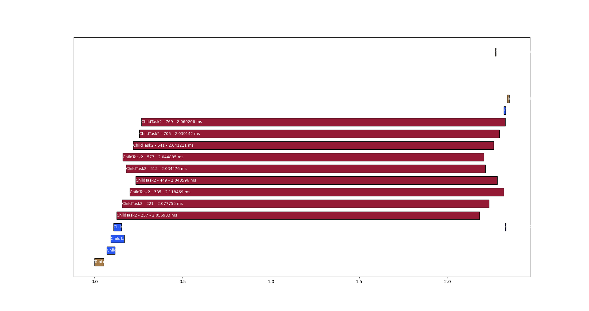

# Logging

As they run, the worker threads each log events to their own circular buffer. When `KillThreads` is called each thread saves their log to a file, these are named

- worker_thread_log_0.txt
- worker_thread_log-1.txt
- worker_thread_log-2.txt
- etc...

You can use the LogVisualizer.py to produce a plot of the scheduling:

The above diagram shows one top level task kicking off 3 child tasks which each kick of three child tasks of their own, which do ~2ms of work.

LogVisualizer.py accepts the following arguments:

- `--txt_glob` - glob expression to find log.txt files, defaults to "../worker_thread_*.txt"
- `--dump_json` - convert the logs into a chronological list of events by fiber and dump as json to stdout